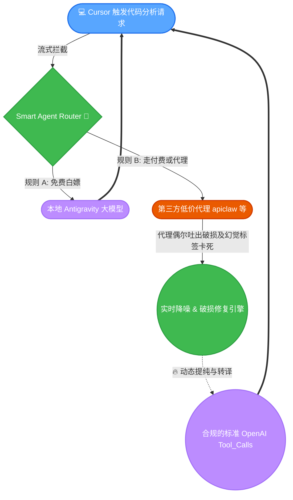

<div align="center">

# 🚀 Smart Agent Router

**让你的 Cursor & Claude Code 突破封锁与平台限制，零配置白嫖本地大模型，完美支持顶级 Agent 工具链！**

[](https://github.com/luoxiafeng-1990/smart-agent-router/stargazers)
[](https://www.python.org/)



</div>

---

## ✨ 它是如何工作的？(核心特性)

传统 AI 代理仅提供简单的文本补全，而 **Smart Agent Router** 专注于 **工具调用 (Tool Calling) 深度适配** 与 **协议劫持**。

### 🔄 动态执行流心智图

> ⬇️ **实时路由流转** (支持点击与交互的矢量关系图)


### 🎯 已经支持的杀手级功能

| 🌟 核心能力 | 🧠 技术底座 | 💡 它能干什么？ |
| :--- | :--- | :--- |
| **API 协议透明转发** | `OpenAI ↔ Anthropic` | 让 Cursor 能**无缝兼容市面上几乎所有低价第三方模型库**。一处配置，端端通用，彻底告别客户端模型调用限制。 |
| **SSRF 智能穿透隧道** | `Cloudflared Security` | 突破市面上 **Cursor 强制拒绝访问 `127.0.0.1`** 的安全封锁，让你能一键通过公网隧道呼叫本地自建的黑科技大模型。 |
| **幻觉拦截与语法修复** | `Streaming Tag Interceptor` | **(独家强力护盾)** 第三方廉价模型常常会幻觉报错或暴露底层 `<tool_call>` 标签导致代码工具瘫痪。我们在底层进行毫秒级滑动窗口过滤，将脏数据转化重塑为合法的代理指令，**拯救那些便宜但“不听话”的大模型！** |
| **本地无限调用免单** | `Reverse Proxy Extractor` | 直接解析拦截对本地 `Gemini Flash/Pro` 的超频运算请求，不需要充值，无限白嫖超强推理算力！ |

---

## 🚀 极速上手 (Quick Start)

### 1. 启动路由核心服务

> **前置要求：** 确保环境中已支持核心 Python 库。

```bash
# 激活环境并启动网关拦截服务
python server.py

# 如果你使用的是限制本地网络访问的 Cursor 客户端，开新终端建立安全通道：
chmod +x start_tunnel.sh
./start_tunnel.sh
```

*(程序成功运行后，隧道会输出一个类似 `https://xxxx.trycloudflare.com` 的网址，把它复制下来！)*

### 2. 🔌 连接客户端配置

打开目标客户端 (如 Cursor / Claude Code / Cline) 的设置面板，做如下操作：

* **Override Base URL**: `https://xxxx.trycloudflare.com/v1` *(重要：结尾务必包含 `/v1`)*
* **API Key**: `sk-cursor-proxy-key` *(默认通关密钥，随意写)*

> <details>
> <summary><b>🤔 我该怎么随意更换背后的第三方代理链接？(点我展开)</b></summary>
> 
> 在根目录下复制 `.env.example` 这份文件并重命名为 `.env`。
> 直接打开并修改里边的环境变量：
> ```env
> EXTERNAL_ANTHROPIC_BASE_URL=https://api.your-custom-proxy.com/
> EXTERNAL_ANTHROPIC_API_KEY=sk-xxxx-xxxx-xxxx
> ```
> 全部保存并只用重启 `server.py`，你的全部出站流量网关即会动态变更！无需重新设置你的 Cursor。
> </details>

---

<br/>

<div align="center">
  <p>🛠️ <b>Made with Passion by Advanced Agent Creators.</b> / Build for AI IDEs Environment.</p>
</div>
